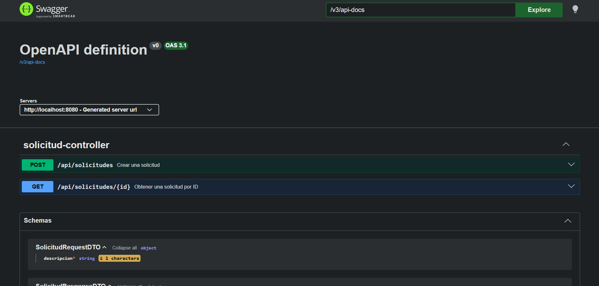

Se ha realizado las funciones de get y post de Solicitudes.

POST /api/solicitudes -> Crea una soliciud

GET /api/solicitudes  -> Obtiene la última actualización de una solicitud dado el id más reciente

Se puede comprobar con http://localhost:8080/swagger-ui/index.html

