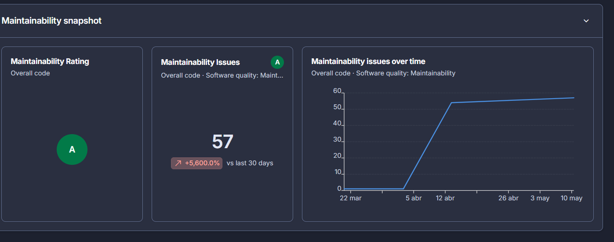
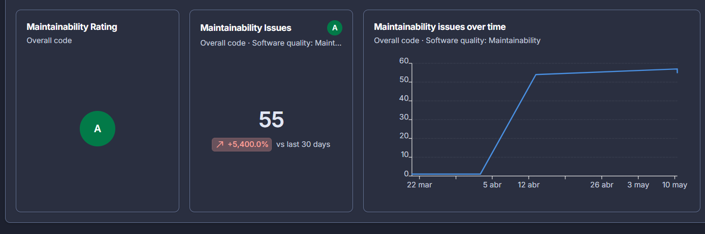

        ------------------Documentación de refactorización----------------------------

Se identifican dos problemas en solicitud.java, siendo estos problemas de mantenimiento.
Se ecomienda cambiar para una mejor estandarización y mejora del mantenimiento a largo plazo.
   
    | if(estado==estadoSolicitud.CERRADA&& this.estado!=estadoSolicitud.EN_PROCESO){ |
    | System.out.println("No se puede hacer el cambio de estado");                   |

Este es el código de uno de los códigos que dan esta problemática para solucionarlo se va a modificar al siguiente modelo:

Antes de modificiar la clase solicitudes.java:

Después de modificar el código se nota una reducción en la dificultad de mantenimiento, basandose en la métrica de Sonar
                                

En cuanto a las técnicas de refactorización creemos que los cambios realizados son más propicios de una modificación en los métodos utilizados para realizar una tarea que en una extracción de un método o la reducción de complejidad cilcomática siendo un cambio en beneficio de la estandarización y la legibilidad, por lo que se eligirá Rename for clarity como tipo de refactorización aún sabiendo que no se ataña estrictamente a su definición las modificaciones que hemos realizado.