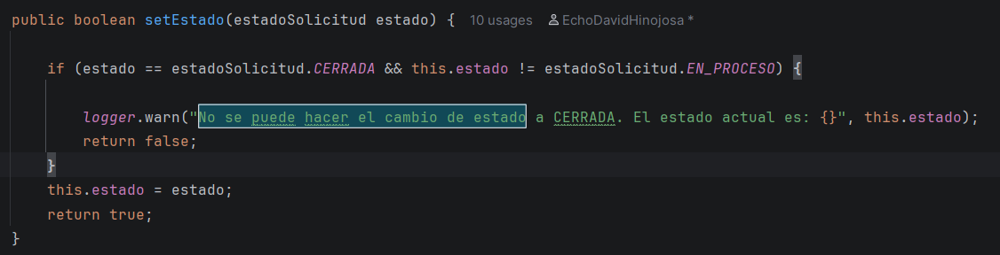

        ------------------Documentación de refactorización----------------------------

Se identifican dos problemas en solicitud.java, siendo estos problemas de mantenimiento.
Se ecomienda cambiar para una mejor estandarización y mejora del mantenimiento a largo plazo.
   
    | if(estado==estadoSolicitud.CERRADA&& this.estado!=estadoSolicitud.EN_PROCESO){ |
    | System.out.println("No se puede hacer el cambio de estado");                   |

Este es el código de uno de los códigos que dan esta problemática para solucionarlo se va a modificar al siguiente modelo:

                                    